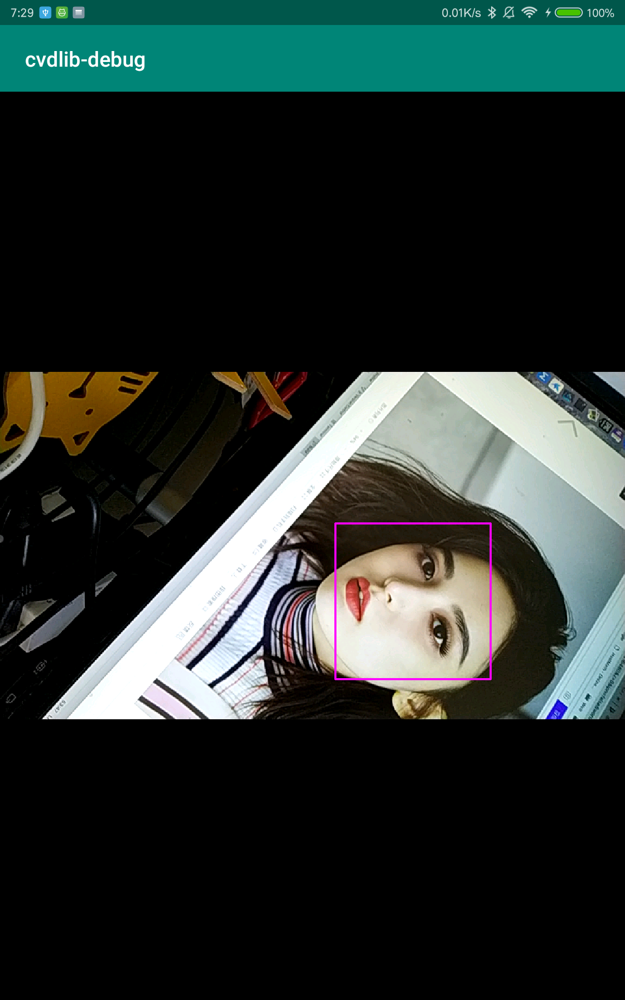

# 在Android Studio工程中集成Dlib
在Android Studio工程中集成Dlib的方法流程，由于本人是Android小白，有错误之处还请指正。
## 集成前需要了解的概念
 1. Dlib是什么？   
     [Dlib](http://dlib.net/)是一个使用C++开发的包含机器学习的图形算法工具。Dlib可以跨平台应用于各种操作系统：windows、MacOS、Linux、iOS、Android等几乎所有平台。而且效率非常高，这一点需要注意。Dlib只有在Release下才能最大限度的发挥效率，在Debug下的效率非常低下。以Android为例，Dlib在Debug下的帧率只有不到2FPS,但是在Release下未做任何优化的情况下可以轻松达到15FPS+
2. Dlib和OpenCV的关系  
    Dlib是一个算法工具，Dlib自身并不能直接使用，必须先准备好OpenCV，才能使用Dlib，所以在集成Dlib之前，我们必须先集成OpenCV。关于在Android Studio中集成OpenCV的方法请移步:https://github.com/ShawnZhang31/opencv-android-studio 查阅。
3. 在Android工程中Dlib和OpenCV的差异   
   OpenCV采用C/C++进行开发，为了保证运行效率使用了很多的C代码，但是最新的OpenCV中C++代码的比重越来越大。Dlib完全是实用C++开发，主要是实用C++11。OpenCV团队专门为Android设备编译的Android版本的OpenCV，不过OpenCV团队在编译Android版本的时候使用的STL是gnustl_static。而Dlib的作者并没有为任何平台编译二进制库，而是给出了CMakeLists.txt让用户自己编译，而Dlib的作者也比较推崇大家将Dlib的源码合并到工程中使用。所以我们使用Dlib必须自己编译。不过Dlib因为使用的是更现代化的C++，Dlib在编译的时候默认使用的STL是c++_static或者c++_shared。再加上Dlic使用了C++11，所以使用默认配置编译出来的dlib.so文件在和opencv连接的时候总是报出非常多的错误，甚至经常出现文件找不到的情况。   
   Android版本的OpenCV的编译相当复杂，有兴趣的可以参看OpenCV官方给出的方法自行编译:https://github.com/opencv/opencv/wiki/Building_OpenCV4Android_from_trunk 。最后的方法是我们采用OpenCV官方编译好的OpenCV库文件，而将Dlib编译的STL修改为gnustl_static，配合OpenCV使用。  
   **注意:2018年10月16日公布的OpenCV 4.0 Beta版本宣称使用了C++编译器。也就意味着与Dlib的默认编译不再存在冲突。因为是Beta版本，我还没有测试，感兴趣的可以自行测试。不过目前OpenCV 4.0 Beta还没有发布Android版本的SDK**
## 集成步骤
### 集成OpenCV  
 1. 创建一个支持C++ 11的Android Studio工程集成OpenCV并实现使用OpenCV打开摄像头  
    具体集成方法请参阅:https://github.com/ShawnZhang31/opencv-android-studio
### 编译Dlib
  1. 编译环境准备(以我个人电脑为例)
     - 操作系统: MacOS 10.14 
     - NDK版本:R16C
     - Dlib版本:19.15
  2. 创建一个dlib4android文件夹并在该文件夹下创建一个jni文件件   
    文件夹结构如下:   
       ```tree
        dlib4android.
                    └── jni
       ```
  3. 将解压的dlib-19.15文件夹拷贝到jni文件夹下,此时文件结构如下:   
      ```tree
        dlib4android.
                    └── jni
                        └── dlib-19.15
                            ├── CMakeLists.txt
                            ├── dlib
                            ├── documentation.html
                            ├── examples
                            ├── ISSUE_TEMPLATE.md
                            ├── MANIFEST.in
                            ├── python_examples
                            ├── README.md
                            ├── setup.py
                            └── tools
       ```  
     虽然我们编译的时候只需要dlib-19.15下的dlib文件夹即可，但是为了保险方便期间都可以放进去。
  4. 在jni文件夹下创建Android.mk和Application.mk文件，此时文件夹结构如下: 
     ```tree
        dlib4android.
                    └── jni
                        ├── Android.mk
                        ├── Application.mk
                        └── dlib-19.15
                            ├── CMakeLists.txt
                            ├── dlib
                            ├── documentation.html
                            ├── examples
                            ├── ISSUE_TEMPLATE.md
                            ├── MANIFEST.in
                            ├── python_examples
                            ├── README.md
                            ├── setup.py
                            └── tools
       ```  
  5. 编辑Android.mk文件内容如下:   
     ```CMake
        LOCAL_PATH := $(call my-dir)
        include $(CLEAR_VARS)
        LOCAL_MODULE := dlib #定义最终输出的.so文件的名称
        LOCAL_SRC_FILES := $(LOCAL_PATH)/dlib-19.15/dlib/all/source.cpp  # 编译的源文件
        include $(BUILD_SHARED_LIBRARY)
     ```
  6. 编辑Application.mk文件内容如下:   
     ```CMake
        APP_OPTIM:=release #设置Dlib采用Release模式编译，虽然Dlib默认就是使用Release模式编译的，但是在这里强调一下省心
        APP_STL := gnustl_static #为了和OpenCV兼容，STL设置为与OpenCV一直，至于OpenCV 4.0等到发布Android版本的时候再来验证
        APP_CPPFLAGS += -std=c++11 #指定采用c++11编译器
        APP_CPPFLAGS += -frtti #支持c++运行时定义，关闭可以节约内存，不过Android手机的内存都辣么大
        APP_CPPFLAGS += -fexceptions #支持C++异常处理
        APP_CPPFLAGS += -DDLIB_NO_GUI_SUPPORT=1 #交叉编译项 dlib提供了基于xquart的图形界面，该界面不支持Android，关闭该界面的支持
        APP_CPPFLAGS += -DLIB_PNG_SUPPORT  #交叉编译项 支持读取PNG图像
        APP_CPPFLAGS += -DLIB_JPEG_SUPPORT #交叉编译项 支持读取JPG图像
        APP_ABI := x86_64, x86, armeabi-v7a, arm64-v8a #指定需要编译的ABI版本，如果设置为all，则编译所有的ABI平台
        APP_PLATFORM := android-16 #编译的SDK版本
        NDK_TOOLCHAIN_VERSION := clang #工具链
     ```
   7. 编译  
      使用终端(Mac)或者CMD(Windows)cd进入jni文件夹，运行你的NDK安装目录下的ndk-build，此时ndk开始编译。  
      不过你很快就会遇到错误而终止，错误提示可能如下:  
      ```c++
        In file included from ../../../../src/main/cpp/dlib-19.15/dlib/opencv.h:10:
        In file included from ../../../../src/main/cpp/dlib-19.15/dlib/opencv/cv_image.h:10:
        In file included from ../../../../src/main/cpp/dlib-19.15/dlib/opencv/../pixel.h:7:
        ../../../../src/main/cpp/dlib-19.15/dlib/serialize.h:1635:30: error: no member named 'to_string' in namespace 'std'
                        std::to_string(objects_read+1) + "th object from the file " + filename +
                        ~~~~~^
        1 error generated.
        ninja: build stopped: subcommand failed.
      ```
      这时候不用担心，这是因为dlib默认使用的是的STL是c++_static，而我们为了配合opencv官方发布的Android SDK在Application.mk文件中将其指定为gnustl_static。而在gnustl_static中std::string是没有实现to_string的方法和round的方法。这个时候我们就需要在dlib-19.15/dlib下面创建一个.h文件来自己实现这个方法了。我在dlib-19.15/dlib下创建了一个**opencv_dlib_bridge.h**文件，并实现这两个方法。**opencv_dlib_bridge.h**的内容如下:
      ```c++
        /**
         * @file opencv_dlib_bridge.h
         * @author SeventyThree
         * @brief OpenCV使用的是gnustl_static模板编译的，Dlib使用的是c++_static，使用该文件将双方结合在一起
         * @version 0.1
         * @date 2018-10-30
         * 
         * @copyright Copyright (c) 2018
         * 
         */

            #include <string>
            #include <sstream>

            using namespace std;
            namespace std{
                template <typename T> std::string to_string(const T& n)
                {
                    std::ostringstream stm;
                    stm << n;
                    return stm.str();
                }

                template <typename T> T round(T v)
                {
                    return (v>0)?(v+0.5):(v-0.5);
                }
            }
      ```
      然后将opencv_dlib_bridge.h文件include到serialize.h文件中即可。这样重新编译，就可以正常通过编译了。ndk会在dlib4android文件夹下面创建libs文件夹存放对应abi的libdlib.so文件.而obj只是临时文件不用理会。
      ```tree
        dlib4android.
                    ├── jni
                    |   ├── Android.mk
                    |   ├── Application.mk
                    |   └── dlib-19.15
                    |       ├── CMakeLists.txt
                    |       ├── dlib
                    |       ├── documentation.html
                    |       ├── examples
                    |       ├── ISSUE_TEMPLATE.md
                    |       ├── MANIFEST.in
                    |       ├── python_examples
                    |       ├── README.md
                    |       ├── setup.py
                    |       └── tools
                    ├── libs
                    |   └── arm64-v8a
                    |       └── libdlib.so
                    |   └── armeabi-v7a
                    |       └── libdlib.so
                    |   └── x86
                    |       └── libdlib.so
                    |   └── x86_64
                    |       └── libdlib.so
                    └── obj
       ```
    8. APP_CPPFLAGS += -DDLIB_JPEG_STATIC带来错误  
       如果在Application.mk文件中添加了这句，在ndk编译的时候还会出现如下所示的找不到文件的错误:  
       ```c++
        undefined reference to 'jpeg_set_quality(jpeg_compress_struct*, int, int)'
        jni/./dlib/all/../image_saver/save_jpeg.cpp:153: error: undefined reference to 'jpeg_start_compress(jpeg_compress_struct*, int)'
        jni/./dlib/all/../image_saver/save_jpeg.cpp:158: error: undefined reference to 'jpeg_write_scanlines(jpeg_compress_struct*, unsigned char**, unsigned int)'
        jni/./dlib/all/../image_saver/save_jpeg.cpp:161: error: undefined reference to 'jpeg_finish_compress(jpeg_compress_struct*)'
       ```
       这也是gnustl_stactic造成的，我们需要在jpeg_loader.cpp文件中加上**extern "C"**  
       ```c++
        #ifdef DLIB_JPEG_SUPPORT

        #include "../array2d.h"
        #include "../pixel.h"
        #include "../dir_nav.h"
        #include "jpeg_loader.h"
        #include <stdio.h>
        #ifdef DLIB_JPEG_STATIC
        extern "C"{
        #   include "../external/libjpeg/jpeglib.h"
        }
        #else
        #   include <jpeglib.h>
        #endif
        #include <sstream>
        #include <setjmp.h>
       ```
 ## 将dlib融合进入Android Studio工程
  1. 将编译出来的libs文件夹下的libdlib.so文件拷贝到src/main/jniLibs文件下
  2. 将jni文件夹下的dlib-19.15文件夹拷贝到src/main/cpp文件下   
     如果觉得整个dlib-19.15文件夹太大，可以只拷贝删除dlib-19.15文件夹下除了dlib文件夹外的其他所有文件。但是一定不能把dlib-19.15文件夹下的dlib文件直接放在cpp文件夹下，具体原因可以看dlib-19.15/dlib/dlib_basic_cpp_build_tutorial.txt中的说明。
  3. 修改app/CMakeLists.txt文件如下所示:
     ```CMake
        # For more information about using CMake with Android Studio, read the
        # documentation: https://d.android.com/studio/projects/add-native-code.html

        # Sets the minimum version of CMake required to build the native library.

        cmake_minimum_required(VERSION 3.4.1)

        #配置OpenCV
        include_directories(${CMAKE_SOURCE_DIR}/src/main/cpp/include)
        add_library( lib_opencv SHARED IMPORTED )
        set_target_properties(lib_opencv PROPERTIES IMPORTED_LOCATION ${CMAKE_CURRENT_SOURCE_DIR}/src/main/jniLibs/${ANDROID_ABI}/libopencv_java3.so)

        #配置dlib
        include_directories(${CMAKE_SOURCE_DIR}/src/main/cpp/dlib-19.15) #设置dlib的include文件路径，如果不设置话再native-lib.cpp文件中则无法引入dlib的头文件
        add_library( lib_dlib SHARED IMPORTED ) # 这里可以随意命名
        set_target_properties(lib_dlib PROPERTIES IMPORTED_LOCATION ${CMAKE_CURRENT_SOURCE_DIR}/src/main/jniLibs/${ANDROID_ABI}/libdlib.so) #将lib_dlib与libdlib.so文件对应

        # Creates and names a library, sets it as either STATIC
        # or SHARED, and provides the relative paths to its source code.
        # You can define multiple libraries, and CMake builds them for you.
        # Gradle automatically packages shared libraries with your APK.

        add_library( # Sets the name of the library.
                        native-lib

                        # Sets the library as a shared library.
                        SHARED

                        # Provides a relative path to your source file(s).
                        src/main/cpp/native-lib.cpp)

        # Searches for a specified prebuilt library and stores the path as a
        # variable. Because CMake includes system libraries in the search path by
        # default, you only need to specify the name of the public NDK library
        # you want to add. CMake verifies that the library exists before
        # completing its build.

        find_library( # Sets the name of the path variable.
            log-lib

            # Specifies the name of the NDK library that
            # you want CMake to locate.
            log)

        # Specifies libraries CMake should link to your target library. You
        # can link multiple libraries, such as libraries you define in this
        # build script, prebuilt third-party libraries, or system libraries.

        target_link_libraries( # Specifies the target library.
                native-lib

                lib_opencv

                lib_dlib #将lib_dlib与native-lib连接在一起

                # Links the target library to the log library
                # included in the NDK.
                ${log-lib})

     ```
   4. 修改app的build.gradle为cmake加入需要编译的指定的abi
      ```Gradle
        externalNativeBuild {
            cmake {
                cppFlags "-std=c++11 -frtti -fexceptions"
                abiFilters "x86", "x86_64", "armeabi-v7a", "arm64-v8a" #你用几个ABI加入几个ABI，但是前提得保证你编译的对应ABI的dlib和opencv
            }
        }
      ```
## 测试dlib
至此dlib已经集成完毕，现在外面使用dlib来检测人脸并绘制出来人脸区域。
 1. 修改nativa-lib.cpp文件如下:
 ```c++
 #include <android/log.h>
#include <jni.h>
#include <string>
#include <opencv2/opencv.hpp>
#include <opencv2/imgproc/imgproc.hpp>
#include <dlib/opencv.h>
#include <dlib/image_processing.h>
#include <dlib/image_processing/frontal_face_detector.h>

#define LOG_TAG "Native-out"
#define LOGD(...) __android_log_print(ANDROID_LOG_DEBUG, LOG_TAG, __VA_ARGS__)
#define LOGI(...) __android_log_print(ANDROID_LOG_INFO, LOG_TAG, __VA_ARGS__)

using namespace std;
using namespace cv;
using namespace dlib;
dlib::frontal_face_detector faceDetector = dlib::get_frontal_face_detector();

extern "C" JNIEXPORT jstring JNICALL Java_com_seventythree_cvdlibdemo_MainActivity_stringFromJNI(
        JNIEnv *env,
        jobject /* this */) {
    std::string hello = "Hello from C++";
    return env->NewStringUTF(hello.c_str());
}

extern "C" JNIEXPORT void JNICALL Java_com_seventythree_cvdlibdemo_MainActivity_cannyDetect(
        JNIEnv *env,
        jobject thiz,
        jlong matAddr) {

    Mat & grayMat = *(Mat * )matAddr;
    matAddr;
    cv::Canny(grayMat, grayMat, 50, 100);

}

extern "C" JNIEXPORT void JNICALL Java_com_seventythree_cvdlibdemo_MainActivity_faceDetect(
        JNIEnv *env,
        jobject thiz,
        jlong matAddr) {
    cv::Mat &img = *(cv::Mat *) matAddr; // 这里的img必须使用&定义，因为我们操作的是内存，否则修改之后的值无法传回给MainActivity
    if (img.channels() ==4)
        cv::cvtColor(img, img, CV_RGBA2BGR);    // onCameraFrame返回的RGB图像是RGBA通道的，这与我们需要的BGR通道不相符，需要转换

    cv::Mat rotatedMat = img.clone();
    cv::rotate(rotatedMat, rotatedMat, ROTATE_90_COUNTERCLOCKWISE); // OpenCV本身的问题，造成获取的图像旋转了90°，而dlib只能识别竖直的人头，所以我们需要逆时针旋转回来

    dlib::cv_image<bgr_pixel> dlibImg(rotatedMat); //dlib的facedetector只接受cv_image<bgr_pixel>图像格式
//
    std::vector<dlib::rectangle> faceRects = faceDetector(dlibImg);
    if (faceRects.size() > 0) {
        LOGD("检测到%d个人脸", faceRects.size());
        for (int i = 0; i < faceRects.size(); ++i) {
            cv::rectangle(rotatedMat,
                          cv::Point((int)faceRects[i].left(), (int)faceRects[i].top()),
                          cv::Point((int)faceRects[i].right(), (int)faceRects[i].bottom()),
                          cv::Scalar(255, 0, 255),
                          2, LINE_8, 0);
        }
        img = rotatedMat.clone();
        cv::rotate(img, img, ROTATE_90_CLOCKWISE);
    } else
    {
        LOGD("未能检测到人脸");
    }

    cv::cvtColor(img, img, CV_BGR2RGBA); //JavaCameraView显示图像需要RGBA通道
}

 ```
 2. 在MainActivity中修改onCameraFrame如下:
 ```Java
     public Mat onCameraFrame(CameraBridgeViewBase.CvCameraViewFrame inputFrame) {
        Mat frame = inputFrame.rgba();
        faceDetect(frame.getNativeObjAddr());
        return frame;
    }
 ```
3. Build工程，如果没有错误，你将会发现应该显示涉嫌头画面的界面一片漆黑。   
  出现这种现象并不是因为JavaCameraView没有渲染，而是一切正常，只不过每帧图像的处理需要将近一分钟的时间，图像还没有处理完，没有办法显示。你或许多等一会儿，就看到图像。  
  出现这个原因是dlib在debug模式效率非常的低，虽然我们使用ndk编译dlib的时候采用的是release的模式，但是CMake将dlib于native-lib打包在一起的时候默认使用的确实debug模式。这个使用我们需要修改app的build.gradle的配置，指定native-lib的打包方式为release.
  ```Gradle
          externalNativeBuild {
            cmake {
                cppFlags "-std=c++11 -frtti -fexceptions -Os -O2"
                arguments  "-DCMAKE_BUILD_TYPE=Release .."
                abiFilters "x86", "x86_64", "armeabi-v7a", "arm64-v8a"
            }
        }
    }
  ```
  一般情况下我们设置**arguments  "-DCMAKE_BUILD_TYPE=Release .."**就可以了，但是对于dlib并不其作用，需要在cppFlags上增加**-Os**，而且这一项与你编译的时候使用的ndk版本有关。
  在你的NDK安装路径下的build/cmake/android.toolchain.cmake文件中有这样一段内容:
  ```CMake
    # Debug and release flags.
    list(APPEND ANDROID_COMPILER_FLAGS_DEBUG -O0)
    if(ANDROID_ABI MATCHES "^armeabi")
    list(APPEND ANDROID_COMPILER_FLAGS_RELEASE -Os)
    else()
    list(APPEND ANDROID_COMPILER_FLAGS_RELEASE -O2)
    endif()
    list(APPEND ANDROID_COMPILER_FLAGS_RELEASE -DNDEBUG)
    if(ANDROID_TOOLCHAIN STREQUAL clang)
    list(APPEND ANDROID_COMPILER_FLAGS_DEBUG -fno-limit-debug-info)
    endif()
  ```
  我的ndk的release标志位-Os或者-O2，所以我选择了cppFlags "-std=c++11 -frtti -fexceptions -Os -O2".此时再build就一切正常了。不过此时还是回比较慢，大概15FPS左右，要想更快就要考虑图像对齐、降采样、跳帧了。
  
## Dlib的其他的问题与讨论
截止目前发现OpenCV和Dlib在Android上都有点问题。而且Android采用了大量开源的东西，组件之间不同的版本之间兼容性也是非常差的，有时候编译不回来的时候不妨按照别人编译成功的软件环境再试试。
1. dlib进行面部关键点检测的时候.dat文件的加载问题   
.dat文件需要放在res/raw文件夹下，使用dlib的deserialize的之前，需要将其拷贝到app的目录下，并将文件的绝对路径传给deserialize。但是在拷贝的时候会发现，把.dat文件放在res/raw文件下build工程的时候，会出现**Cause: invalid code lengths set**这样一个莫名其妙的错误。这是由于Java Maven的Bug造成的，虽然.dat是二进制文件，但是Maven认为其文件编码格式有问题，不允许通过。这个bug暂时无解。只能将.dat文件压缩为zip文件，拷贝到制定的位置之后再解压出来。
2. JavaCameraView的图片尺寸和朝向问题  
使用OpenCV JavaCameraView获取的图像朝向有问题，而且尺寸修改也比较麻烦。关键是我们修改之后会报错。网上有一些修正方法，但都是后遗症。如果使用Android源生的Camera类获取摄像头数据就需要将Bitmap转化为Mat,中间多了一部操作，对于实时图像处理会影响效率。目前OpenCV官方要在OpenCV4.0修复这个bug，目前还没有看到对应的SDK发布。在实时处理图像的应用中最好使用OpenCV打开摄像头的方式，这样才能获得尽可能高的帧率。
